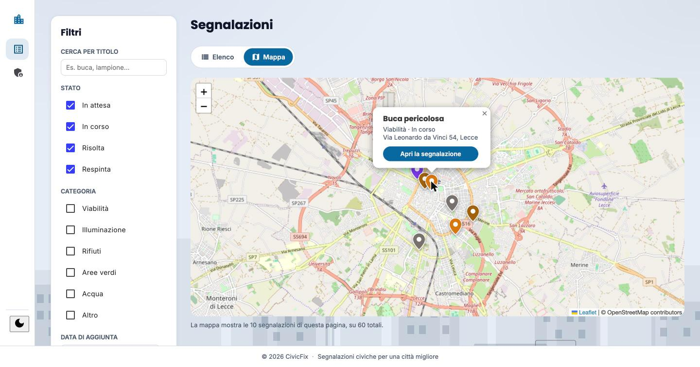
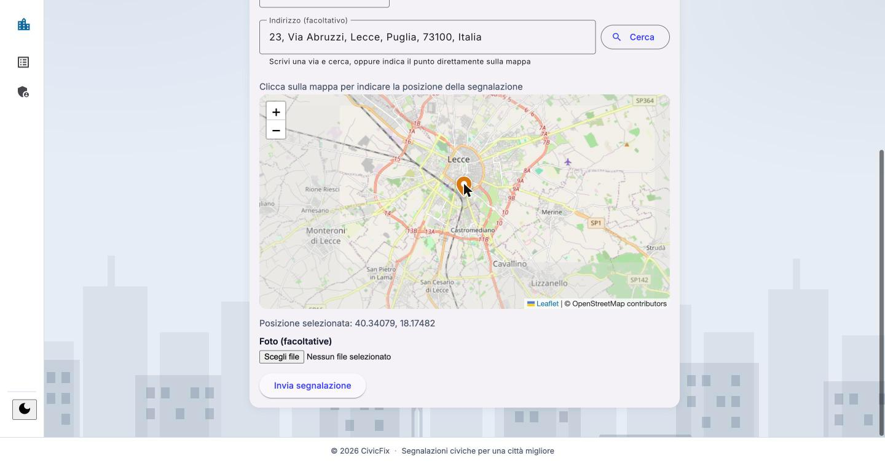
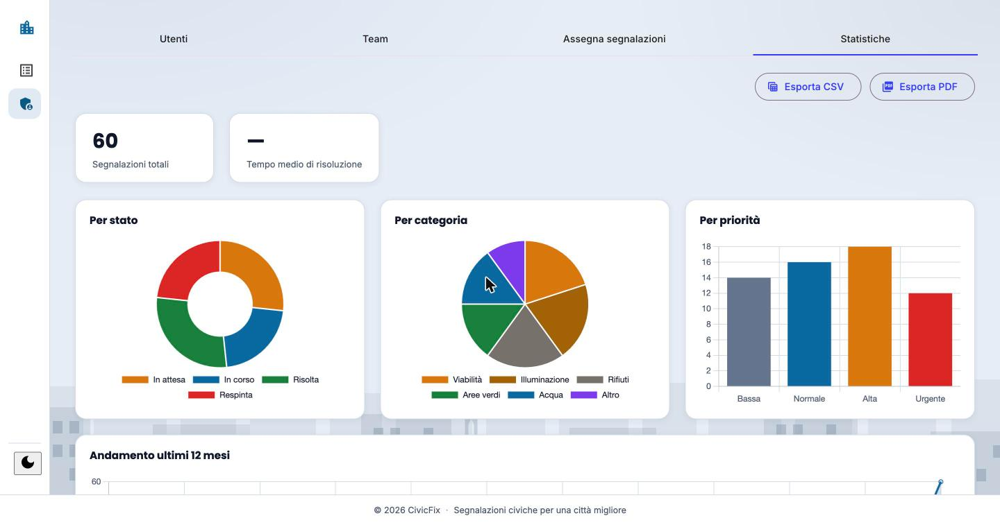

# CivicFix


**CivicFix** è una piattaforma di segnalazione civica: i cittadini segnalano problemi urbani — buche, illuminazione guasta, rifiuti abbandonati — geolocalizzandoli su una mappa; gli operatori comunali, organizzati in team per categoria, li prendono in carico e ne aggiornano lo stato fino alla risoluzione; un amministratore gestisce utenti, team e monitora l'andamento con statistiche in tempo reale.


## 📸 Screenshot

| Mappa delle segnalazioni | Creazione segnalazione |
|---|---|
|  |  |

| Dashboard statistiche | Dettaglio segnalazione |
|---|---|
|  |  |

## ✨ Funzionalità principali

**Per i cittadini**
- Registrazione e login con autenticazione JWT
- Recupero password via email con token monouso
- Creazione di segnalazioni geolocalizzate, con foto multiple, categoria e descrizione
- Modifica o cancellazione della propria segnalazione finché non è stata presa in carico
- Ricerca filtrata per categoria, stato, titolo, intervallo di date e ricerca "vicino a me" per raggio
- Voto/sostegno alle segnalazioni di altri cittadini (non alle proprie)
- Cronologia della segnalazione: commenti e cambi di stato

**Per gli operatori**
- Visualizzazione delle segnalazioni assegnate al proprio team
- Aggiornamento dello stato di lavorazione fino alla risoluzione

**Per l'amministratore**
- Gestione di utenti e team, con assegnazione degli operatori ai team per categoria
- Assegnazione di team, operatore e priorità alle segnalazioni aperte
- Dashboard statistiche (per stato, categoria, priorità, andamento mensile, team più attivi) con grafici ed esportazione in CSV e PDF

**Trasversali**
- Tema chiaro/scuro
- Documentazione API interattiva con Swagger/OpenAPI

## 🏗️ Architettura

Backend a strati classico: `controller → service → repository`, con le regole di autorizzazione (proprietà del dato, non solo ruolo) centralizzate nel service. Autenticazione stateless via JWT — nessuna sessione lato server. Ricerca filtrata costruita con lo `Specification` pattern di Spring Data, incluso un filtro geografico "vicino a me" a due passaggi (bounding box + distanza reale).

```
backend/
├── controller/     # endpoint REST
├── service/        # logica di business e regole di autorizzazione
├── repository/     # accesso ai dati (Spring Data JPA)
│   └── specification/  # filtri di ricerca componibili
├── model/          # entità JPA
├── dto/            # oggetti di scambio con il client
├── mapper/         # conversione entità → DTO
├── security/       # JWT, filtri, UserDetails
├── doc/            # annotazioni Swagger riusabili
└── config/         # sicurezza, CORS, seed dati, OpenAPI

frontend/
├── core/
│   ├── services/    # chiamate HTTP e stato applicativo
│   ├── guards/      # protezione delle rotte
│   ├── interceptors/# allegare il JWT alle richieste
│   └── models/      # interfacce TypeScript
├── features/        # pagine: auth, segnalazioni, area admin
└── shared/          # componenti riutilizzabili (mappa, navbar, card...)
```

## 🛠️ Stack tecnologico

**Backend** — Java 25 · Spring Boot · Spring Security (JWT) · Spring Data JPA · MySQL · Bean Validation · Spring Mail · springdoc-openapi (Swagger UI) · Lombok · JUnit / Mockito

**Frontend** — Angular (standalone components) · TypeScript · Angular Material · Leaflet (mappa) · Chart.js (grafici) · jsPDF (esportazione PDF)

## 🚀 Avvio del progetto

### Backend

```bash
cd backend
```

La configurazione legge le credenziali da variabili d'ambiente (vedi `application.properties`). Impostale prima di avviare, ad esempio:

```bash
export DB_PASS=...
export JWT_SECRET=...
export ADMIN_USERNAME=...
export ADMIN_EMAIL=...
export ADMIN_PASSWORD=...
export MAIL_USERNAME=...   # opzionale: senza, l'invio email viene solo saltato
export MAIL_PASSWORD=...   # password per le app di Gmail, non quella dell'account
```

Assicurati che MySQL sia attivo e che esista un database `civicfix`. Se il driver rifiuta la connessione con `Public Key Retrieval is not allowed`, verifica che l'URL nel datasource includa `?allowPublicKeyRetrieval=true&useSSL=false`.

Poi avvia:

```bash
./mvnw spring-boot:run
```

- API disponibile su `http://localhost:8080/api`
- Documentazione Swagger su `http://localhost:8080/swagger-ui/index.html`

### Frontend

```bash
cd frontend/civicfix-frontend
npm install
ng serve
```

- App disponibile su `http://localhost:4200`

## 📄 Documentazione API

L'intera API è documentata con OpenAPI/Swagger, raggruppata per pubblico (Pubblico, Cittadino, Operatore, Admin) e consultabile via Swagger UI una volta avviato il backend.

## 👤 Autore

**David De Nicola**
[GitHub](https://github.com/DavidDeNicola) 

## 📜 Licenza

Distribuito con licenza [MIT](LICENSE).
